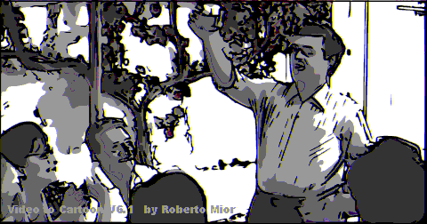



## VIDEO TO CARTOON V7

### Description

Converts Video to Cartoon! Basically it reduces the numbers of colors and applies a Contour. But everything is enhanced by simply and powerful potrace.exe that brings so cool curves. 

----

-See Srceenshot(B&amp;N in this case.)- 

----

This application uses FreeImage.dll and Potrace.exe. This files should be included in this Zip. If Not so, included Downloadhelper.vbp will bring you to that locations.

It doesn't manage Audio. You can do it manually with VirtualDub. 

----

V7.0 *NEW* BILATERAL FILTER. Applicable Parameters: 'Color Paramters': Brightness and Contrast, plus main 'CONTOUR Params' slider.
 
### More Info
 

             |
---                |---
**Submitted On**   |2010-01-12 19:37:02
**By**             |[reexre](https://github.com/Planet-Source-Code/PSCIndex/blob/master/ByAuthor/reexre.md)
**Level**          |Intermediate
**User Rating**    |5.0 (25 globes from 5 users)
**Compatibility**  |VB 6\.0
**Category**       |[Complete Applications](https://github.com/Planet-Source-Code/PSCIndex/blob/master/ByCategory/complete-applications__1-27.md)
**World**          |[Visual Basic](https://github.com/Planet-Source-Code/PSCIndex/blob/master/ByWorld/visual-basic.md)
**Archive File**   |[VIDEO\_TO\_C2172701122010\.zip](https://github.com/Planet-Source-Code/reexre-video-to-cartoon-v7__1-72418/archive/master.zip)

